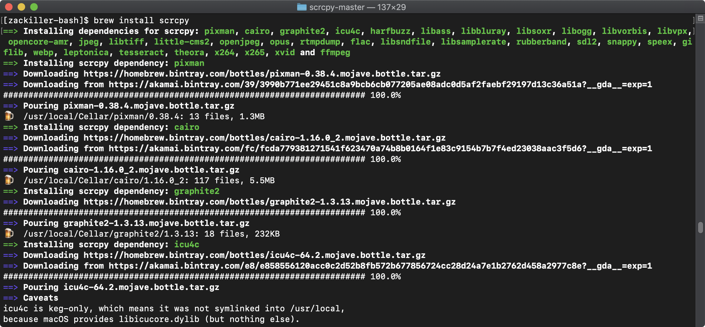

# 오큘러스 퀘스트의 영상 녹화 또는 실시간 방송

오큘러스 퀘스트의 로비(홈 화면)의 메인 메뉴에 [녹화] 기능이 있으나 개발중인 콘텐츠는 동영상을 녹화할 수 없지만 다음과 같은 방법으로 실시간으로 영상을 송출하거나 또는 동영상을 녹화하는 방법을 소개한다.

## 맥/리눅스 환경의 준비과정

- [scrcpy](https://github.com/Genymobile/scrcpy) : 안드로이드 기기의 화면을 녹화하거나 조작할 수 있는 소스, adb 환경이 설정되야 하며 USB 또는 Wifi로 접근이 가능하다.
- OBS 스튜디오 [OBS Studio](https://obsproject.com/ko) : 오픈소스로 운영되는 스트리밍 방송 녹화 및 송출 어플리케이션

## 윈도우 환경의 준비과정

윈도우OS의 경우 다음 설치 파일을 내려받은 후 설치한다.

- Win32 [scrcpy-win32-v1.9.zip](https://github.com/Genymobile/scrcpy/releases/download/v1.9/scrcpy-win32-v1.9.zip)
- Win64 [scrcpy-win64-v1.9.zip](https://github.com/Genymobile/scrcpy/releases/download/v1.9/scrcpy-win64-v1.9.zip)
- OBS 스튜디오 [OBS Studio](https://obsproject.com/ko) : 오픈소스로 운영되는 스트리밍 방송 녹화 및 송출 어플리케이션

## 맥 설치과정

터미널에서 scrcpy 폴더로 이동후 다음 명령어 실행한다. [Homebrew](https://brew.sh/)가 설치 되어있어야 한다.
```
[zackiller-bash]$ brew install scrcpy
```




만약, 환경설정 Path에 adb가 설정되지 않았다면 다음과 같이 명령어를 실행한다.
```
[zackiller-bash]$ brew cask install android-platform-tools
```


