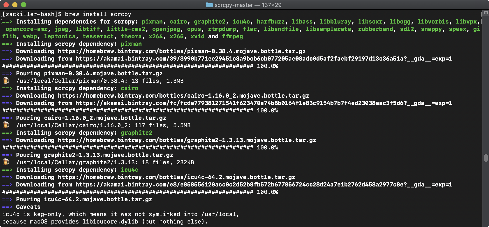
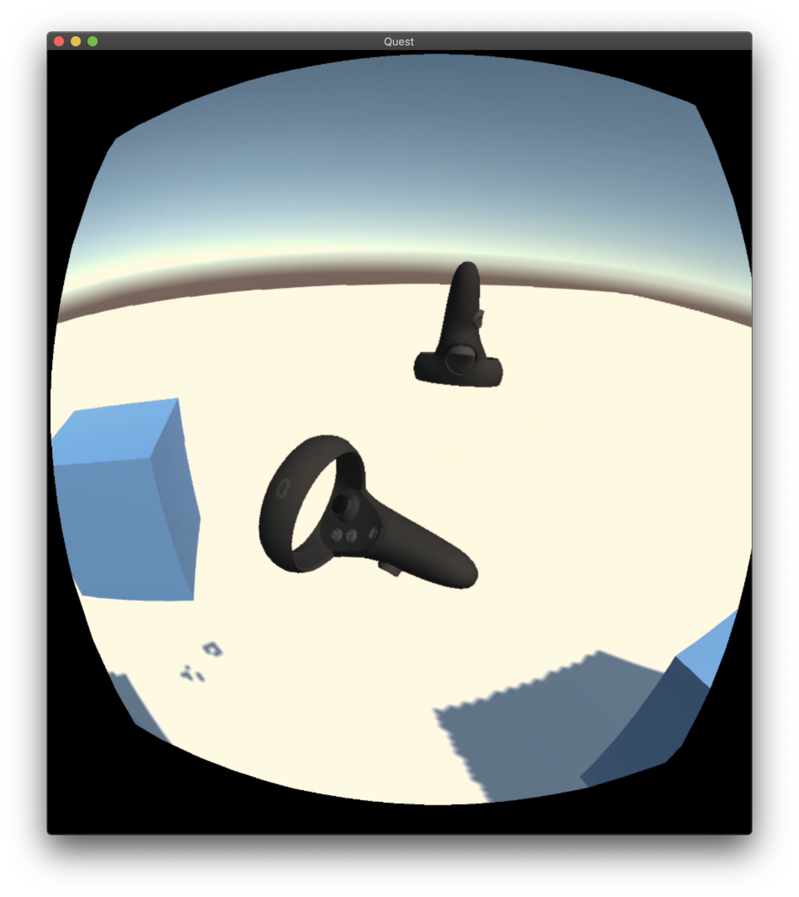

# 오큘러스 퀘스트의 영상 녹화 또는 실시간 방송

오큘러스 퀘스트는 2019년 말에 [오큘러스 링크(Link)](https://support.oculus.com/444256562873335/) 기능을 추가해 Vive와 같이 콘텐츠를 PC에서 구동하는 기능을 지원하기 시작했다. 유니티로 개발한다면 Game View를 통해 즉시 확인할 수 있어  매번 빌드해서 결과를 확인하던 방식에 비해 개발 환경이 쾌적해졌다.

이번 포스팅은 오큘러스 퀘스트의 콘텐츠 실행화면을 실시간 송출하거나 녹화하는 환경을 소개한다. 물론 오큘러스 퀘스트의 로비의 메인 메뉴에 [녹화] 기능이 있으나 개발중인 콘텐츠의 동영상을 녹화할 수 없다. 따라서, 다음과 같이 scrcpy를 사용해 실시간으로 영상을 송출하거나 또는 동영상을 녹화하는 방법을 소개한다.

## 맥/리눅스 환경의 준비과정

- [scrcpy](https://github.com/Genymobile/scrcpy) : 안드로이드 기기의 화면을 녹화하거나 조작할 수 있는 소스, adb 환경이 설정되야 하며 USB 또는 Wifi로 접근이 가능하다.
- OBS 스튜디오 [OBS Studio](https://obsproject.com/ko) : 오픈소스로 운영되는 스트리밍 방송 녹화 및 송출 어플리케이션

## 맥 설치과정

터미널에서 scrcpy 폴더로 이동후 다음 명령어 실행한다. [Homebrew](https://brew.sh/)가 설치 되어있어야 한다.
```
$ brew install scrcpy
```




만약, 환경설정 Path에 adb가 설정되지 않았다면 다음과 같이 명령어를 실행한다.
```
$ brew cask install android-platform-tools
```

## 윈도우 환경의 준비과정

윈도우OS의 경우 다음 설치 파일을 내려받은 후 설치한다.

- Win32 [scrcpy-win32-v1.9.zip](https://github.com/Genymobile/scrcpy/releases/download/v1.9/scrcpy-win32-v1.9.zip)
- Win64 [scrcpy-win64-v1.9.zip](https://github.com/Genymobile/scrcpy/releases/download/v1.9/scrcpy-win64-v1.9.zip)
- OBS 스튜디오 [OBS Studio](https://obsproject.com/ko) : 오픈소스로 운영되는 스트리밍 방송 녹화 및 송출 어플리케이션

- [adb 설치 및 환경변수 설정](https://www.google.com/search?ei=dBs3XZrsO4OC-QaM-4CYAw&q=adb+path+windows+10+&oq=adb+path+windows+10+&gs_l=psy-ab.3..35i39j0i30j0i5i30l3.12343.14300..14996...0.0..0.186.1250.1j10......0....1..gws-wiz.......33i160j33i21.mPkZgAMGEWI&ved=&uact=5)


## 레코딩 순서

### 오큘러스 퀘스트 연결 및 scrcpy 실행

1. 오큘러스 퀘스트와 USB 케이블 연결
2. 터미널(윈도우 cmd)에서 adb devices 명령어로 퀘스트가 연결됐는지를 확인
3. scrcpy 명령어 실행
4. 퀘스트에서 레코딩할 어플 실행


## scrcpy 명령어

- 단순 실행
```
scrcpy
```


- 크롭 기능 (오큘러스 퀘스트 2880:1600 - 한쪽 눈 1440:1600)
가로해상도:세로해상도:오프셋x:오프셋y
```
scrcpy --crop 1440:1600:0:0
```



- [본 문서는 다음 동영상을 참조했음](https://www.youtube.com/watch?v=Ora7OrQHwEs&feature=youtu.be)